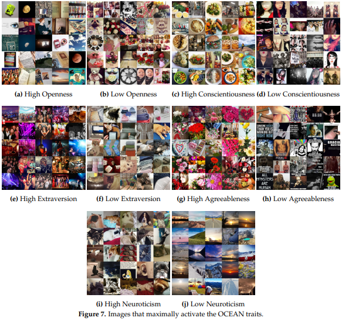
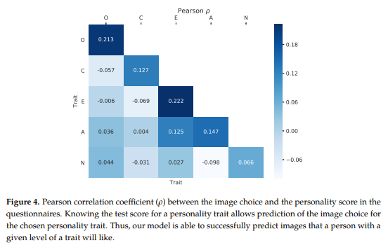

# Personality-Trait-Analysis
This repo consists of the PyTorch implementation of the work presented at [Applied Sciences 2020](https://www.mdpi.com/journal/applsci/sections/computing_artificial_intelligence). **Personality Trait Analysis in Social Networks based on Weakly Supervised Learning of Shared Images**

Social networks have attracted the attention of psychologists, as the behavior of users can be used to assess personality traits, and to detect sentiments and critical mental situations such as depression or suicidal tendencies. Recently, the increasing amount of image uploads to social networks has shifted the focus from text to image-based personality assessment. However, obtaining the ground-truth requires giving personality questionnaires to the users, making the process very costly and slow, and hindering research on large populations. In this paper, we demonstrate that it is possible to predict which images are most associated with each personality trait of the OCEAN personality model, without requiring ground-truth personality labels. Namely, we present a weakly supervised framework which shows that the personality scores obtained using specific images textually associated with particular personality traits are highly correlated with scores obtained using standard text-based personality questionnaires. We trained an OCEAN trait model based on Convolutional Neural Networks (CNNs), learned from 120K pictures posted with specific textual hashtags, to infer whether the personality scores from the images uploaded by users are consistent with those scores obtained from text. In order to validate our claims, we performed a personality test on a heterogeneous group of 280 human subjects, showing that our model successfully predicts which kind of image will match a person with a given level of a trait. Looking at the results, we obtained evidence that personality is not only correlated with text, but with image content too.  Interestingly, different visual patterns emerged from those images most liked by persons with a particular personality trait: for instance, pictures most associated with high conscientiousness usually contained healthy food, while low conscientiousness pictures contained injuries, guns, and alcohol. These findings could pave the way to complement text-based personality questionnaires
with image-based questions.

    

    

CODE and citation details will be uploaded soon
